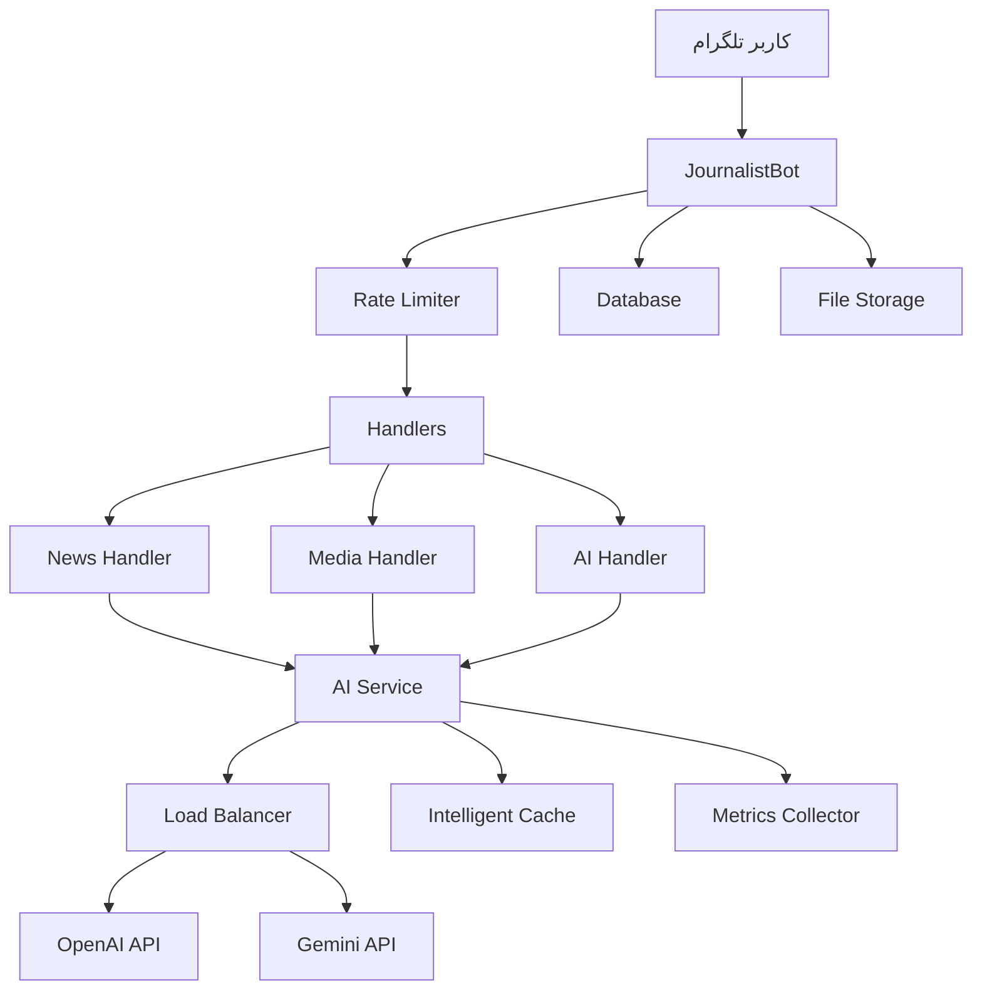

# 🤖 Assistant Journalist Bot

<div align="center">


**ربات هوشمند دستیار خبرنگار با قابلیت‌های پیشرفته AI**

*یک پلتفرم کامل برای تولید محتوا، راستی‌آزمایی، و تولید رسانه با استفاده از هوش مصنوعی*

[دمو زنده](#) • [مستندات](#-مستندات) • [نصب](#-نصب-سریع) • [پشتیبانی](#-پشتیبانی)

</div>

---

## 📋 فهرست مطالب

- [✨ ویژگی‌های کلیدی](#-ویژگی‌های-کلیدی)
- [🏗️ معماری سیستم](#️-معماری-سیستم)
- [🚀 نصب سریع](#-نصب-سریع)
- [⚙️ تنظیمات](#️-تنظیمات)
- [📖 استفاده](#-استفاده)
- [🔧 پیکربندی پیشرفته](#-پیکربندی-پیشرفته)
- [📊 مانیتورینگ](#-مانیتورینگ)
- [🧪 تست](#-تست)
- [🚀 استقرار Production](#-استقرار-production)
- [🤝 مشارکت](#-مشارکت)
- [🆘 پشتیبانی](#-پشتیبانی)

---

## ✨ ویژگی‌های کلیدی

### 📰 تولید محتوای خبری
- **تیتر و لید هوشمند** - سیستم پرامپت حرفه‌ای با محدودیت 7 کلمه
- **خلاصه‌سازی مقالات** - حفظ نکات کلیدی با زبان ساده
- **سوالات مصاحبه** - تولید 10 سوال حرفه‌ای از ساده به پیچیده
- **بیانیه مطبوعاتی** - ساختار استاندارد 5W+H

### 🔍 راستی‌آزمایی پیشرفته
- **پروتکل SWIFT-VERIFY** - سیستم 6 مرحله‌ای تأیید اطلاعات
- **رتبه‌بندی منابع** - طبقه‌بندی 4 سطحی (🟢🟡🟠🔴)
- **گزارش جامع** - شامل درجه اطمینان و راهنمایی عملی
- **تشخیص اخبار جعلی** - الگوریتم‌های پیشرفته تشخیص

### 🎬 تولید رسانه
- **اسکریپت ویدیو بهینه** - معماری شناختی برای حفظ 95% مخاطب
- **قلاب‌های پلتفرم محور** - بهینه‌سازی برای TikTok، Instagram، YouTube
- **اسکریپت پادکست** - ساختار حرفه‌ای با CTA
- **محتوای شبکه‌های اجتماعی** - شامل هشتگ و ایموجی

### 🤖 ابزارهای AI پیشرفته
- **مهندس پرامپت** - روش CRAFT برای تولید پرامپت‌های حرفه‌ای
- **بهینه‌ساز تصویر** - تبدیل ایده به prompt مناسب DALL-E/Midjourney
- **طراح چت‌بات** - ایجاد پرامپت‌های کامل چت‌بات
- **کتابخانه الگو** - مجموعه پرامپت‌های آماده

### ⚡ قابلیت‌های فنی پیشرفته
- **Rate Limiting هوشمند** - مدیریت ترافیک با محدودیت کاربری
- **Caching پیشرفته** - کش هوشمند با TTL و LRU
- **Load Balancing** - تعادل بار بین OpenAI و Gemini
- **Retry Mechanism** - تلاش مجدد با Exponential Backoff
- **Metrics Collection** - جمع‌آوری آمار کامل عملکرد
- **Health Monitoring** - نظارت بر سلامت سیستم

---

## 🏗️ معماری سیستم



### ساختار پروژه

```
assistant_journalist_bot/
├── 🚀 main.py                    # نقطه ورود اصلی
├── 🔐 .env.example              # نمونه تنظیمات
├── 📦 requirements.txt           # وابستگی‌ها
├── 🐳 Dockerfile               # کانتینر Docker
├── 🐳 docker-compose.yml       # Orchestration
├── 📚 README.md                 # مستندات
├── ⚖️ LICENSE                   # مجوز
├── 🚫 .gitignore               # فایل‌های نادیده
│
├── 📂 core/                    # هسته سیستم
│   ├── ⚙️ bot.py               # ربات اصلی + Rate Limiting + Metrics
│   └── 🔧 config.py            # تنظیمات
│
├── 📂 handlers/                # مدیریت کننده‌ها
│   ├── 📰 news_handlers.py     # مدیریت اخبار
│   ├── 🎬 media_handlers.py    # مدیریت رسانه
│   └── 🤖 ai_handlers.py       # مدیریت AI
│
├── 📂 services/               # سرویس‌ها
│   └── 🧠 ai_service.py       # سرویس AI + Cache + Load Balancer
│
├── 📂 utils/                  # ابزارها
│   └── ⌨️ keyboards.py        # کیبوردهای تلگرام
│
├── 📂 data/                   # داده‌ها
│   ├── 📝 prompts.py          # سیستم پرامپت‌های حرفه‌ای
│   └── 📄 templates/          # الگوهای محتوا
│
├── 📂 uploads/                # فایل‌های آپلود شده
├── 📂 cache/                  # کش سیستم
├── 📂 logs/                   # لاگ‌های سیستم
└── 📂 tests/                  # تست‌ها
```

---

## 🚀 نصب سریع

### پیش‌نیازها
- **Python 3.9+** (توصیه: 3.11)
- **FFmpeg** (برای پردازش رسانه)
- **4GB RAM** حداقل (8GB توصیه می‌شود)
- **2GB فضای دیسک** برای کتابخانه‌ها

### 🔧 نصب خودکار (Linux/macOS)

```bash
# دانلود و اجرای اسکریپت نصب
curl -fsSL https://raw.githubusercontent.com/your-repo/install.sh | bash
```

### 📋 نصب دستی

```bash
# 1. کلون پروژه
git clone https://github.com/your-username/assistant-journalist-bot.git
cd assistant-journalist-bot

# 2. ایجاد محیط مجازی
python -m venv venv

# 3. فعال‌سازی محیط مجازی
# Linux/macOS:
source venv/bin/activate
# Windows:
venv\Scripts\activate

# 4. نصب وابستگی‌ها
pip install -r requirements.txt

# 5. کپی تنظیمات
cp .env.example .env

# 6. ویرایش تنظیمات
nano .env  # یا هر ویرایشگر دیگر

# 7. تست سیستم
python main.py --health

# 8. اجرا
python main.py
```

### 🐳 نصب با Docker

```bash
# آماده‌سازی
git clone https://github.com/your-username/assistant-journalist-bot.git
cd assistant-journalist-bot
cp .env.example .env
# ویرایش .env

# اجرای سریع
docker-compose up -d

# مشاهده لاگ‌ها
docker-compose logs -f
```

---

## ⚙️ تنظیمات

### 🔑 API Keys ضروری

#### 1. Telegram Bot Token
```bash
# 1. برو به @BotFather در تلگرام
# 2. ارسال /newbot
# 3. نام و username ربات را انتخاب کن
# 4. Token دریافتی را کپی کن
BOT_TOKEN=1234567890:ABCdefGHIjklMNOpqrsTUVwxyz
BOT_USERNAME=your_bot_username
```

#### 2. OpenAI API Key
```bash
# 1. ثبت نام در https://platform.openai.com
# 2. ایجاد API Key در بخش API Keys
# 3. افزودن اعتبار مالی (حداقل $5)
OPENAI_API_KEY=sk-proj-your_openai_key_here
```

#### 3. Google Gemini API Key
```bash
# 1. رفتن به https://ai.google.dev
# 2. کلیک روی "Get API Key"
# 3. ایجاد پروژه جدید Google Cloud
GEMINI_API_KEY=your_gemini_key_here
```

### 🔧 تنظیمات اختیاری

```env
# News API (برای تأیید اطلاعات)
NEWS_API_KEY=your_news_api_key

# مدیران (کاما جدا شده)
ADMIN_IDS=123456789,987654321

# پایگاه داده
DATABASE_URL=sqlite:///bot.db

# تنظیمات Rate Limiting
MAX_REQUESTS_PER_MINUTE=30
FREE_DAILY_LIMIT=50
PRO_DAILY_LIMIT=500

# تنظیمات Cache
CACHE_TTL_HOURS=12
CACHE_MAX_SIZE=1000
```

---

## 📖 استفاده

### 🎯 دستورات اصلی
- `/start` - شروع ربات و معرفی
- `/menu` - نمایش منوی اصلی
- `/help` - راهنمای کامل استفاده
- `/mystats` - آمار شخصی کاربر
- `/stats` - آمار کلی (فقط ادمین‌ها)

### 📱 نحوه استفاده

#### 1️⃣ تولید تیتر و لید خبری
```
1. کلیک روی "📰 تولید محتوا"
2. انتخاب "📝 نگارش خبر"
3. ارسال متن خبری
4. دریافت 3 جفت تیتر و لید
```

#### 2️⃣ راستی‌آزمایی اطلاعات
```
1. کلیک روی "🔍 تحقیق و تحلیل"
2. انتخاب "✅ راستی‌آزمایی"
3. ارسال ادعا یا اطلاعات
4. دریافت گزارش کامل بررسی
```

#### 3️⃣ تولید اسکریپت ویدیو
```
1. کلیک روی "🎬 تولید رسانه"
2. انتخاب "🎥 اسکریپت ویدیو"
3. ارسال موضوع، مدت و پلتفرم
4. دریافت اسکریپت کامل
```

#### 4️⃣ مهندسی پرامپت
```
1. کلیک روی "⚙️ ابزارهای AI"
2. انتخاب "🤖 مهندس Prompt"
3. توضیح نیازمندی‌های پرامپت
4. دریافت پرامپت حرفه‌ای
```

### 💡 نکات کاربردی

#### ✨ برای بهترین نتایج:
- **متن‌های واضح** ارسال کنید
- **زمینه کافی** ارائه دهید
- **زبان فارسی** استفاده کنید
- **از مثال‌ها** در درخواست استفاده کنید

#### ⚡ محدودیت‌ها:
- **کاربران عادی**: 30 درخواست در دقیقه
- **کاربران پریمیوم**: 100 درخواست در دقیقه
- **حجم فایل**: حداکثر 50MB

---

## 🔧 پیکربندی پیشرفته

### 🏷️ Environment Variables

| متغیر | نوع | پیش‌فرض | توضیح |
|-------|------|---------|-------|
| `BOT_TOKEN` | **ضروری** | - | توکن ربات تلگرام |
| `OPENAI_API_KEY` | ضروری* | - | کلید API OpenAI |
| `GEMINI_API_KEY` | ضروری* | - | کلید API Google Gemini |
| `MAX_REQUESTS_PER_MINUTE` | اختیاری | 30 | محدودیت درخواست در دقیقه |
| `CACHE_TTL_HOURS` | اختیاری | 12 | مدت زمان نگهداری کش |
| `LOG_LEVEL` | اختیاری | INFO | سطح لاگ (DEBUG/INFO/WARNING/ERROR) |

*\* حداقل یکی از OpenAI یا Gemini ضروری است*

### 🔄 Load Balancing

سیستم به صورت خودکار بین OpenAI و Gemini تعادل برقرار می‌کند:

```python
# تنظیمات Load Balancer
LOAD_BALANCER_STRATEGY = "performance"  # performance/round_robin/random
```

### 💾 Cache Configuration

```python
# تنظیمات Cache
CACHE_BACKEND = "memory"  # memory/redis/database
CACHE_MAX_SIZE = 1000     # تعداد ورودی‌ها
CACHE_TTL_HOURS = 12      # مدت زمان نگهداری
```

### 📊 Metrics Configuration

```python
# تنظیمات Metrics
METRICS_ENABLED = True
METRICS_RETENTION_DAYS = 30
METRICS_EXPORT_FORMAT = "json"  # json/csv/prometheus
```

---

## 📊 مانیتورینگ

### 📈 آمار در دسترس

#### آمار کلی ربات
```bash
# دسترسی از طریق دستور
/stats

# شامل:
- زمان فعالیت
- تعداد کاربران
- کاربران فعال امروز
- کل پیام‌ها
- درخواست‌های AI
- نرخ خطا
- میانگین زمان پاسخ
```

#### آمار شخصی کاربر
```bash
# دسترسی از طریق دستور  
/mystats

# شامل:
- مدت عضویت
- تعداد پیام‌ها
- درخواست‌های AI
- وضعیت Rate Limiting
```

### 📋 Dashboard وب (در حال توسعه)

```bash
# اجرای dashboard
python dashboard.py

# دسترسی در:
http://localhost:8080/dashboard
```

### 📊 Export آمار

```bash
# Export به JSON
python main.py --export-stats json

# Export به CSV
python main.py --export-stats csv

# Export به Prometheus
python main.py --export-stats prometheus
```

---

## 🧪 تست

### 🔍 تست سلامت سیستم

```bash
# بررسی کلی
python main.py --health

# بررسی AI Services
python -m services.ai_service --health

# بررسی اتصال به APIs
python -c "from services.ai_service import ai_service; import asyncio; asyncio.run(ai_service.health_check())"
```

### 🧪 تست‌های Unit

```bash
# نصب ابزارهای تست
pip install pytest pytest-asyncio pytest-cov

# اجرای تست‌ها
pytest tests/ -v

# تست با coverage
pytest tests/ --cov=. --cov-report=html
```

### 🎯 تست‌های Integration

```bash
# تست کامل با ربات واقعی
pytest tests/integration/ -v --bot-token=YOUR_TEST_TOKEN

# تست Load
python tests/load_test.py --users=100 --duration=300
```

### 📝 تست‌های دستی

```bash
# ارسال پیام تست
curl -X POST "https://api.telegram.org/bot<TOKEN>/sendMessage" \
  -H "Content-Type: application/json" \
  -d '{"chat_id":"YOUR_CHAT_ID","text":"/start"}'
```

---

## 🚀 استقرار Production

### 🐳 استقرار با Docker

#### Docker Compose (توصیه شده)

```yaml
# docker-compose.prod.yml
version: '3.8'

services:
  journalist-bot:
    build: .
    container_name: assistant-journalist-bot
    restart: unless-stopped
    env_file:
      - .env.production
    volumes:
      - ./logs:/app/logs
      - ./uploads:/app/uploads
      - ./cache:/app/cache
    environment:
      - TZ=Asia/Tehran
      - ENVIRONMENT=production
    healthcheck:
      test: ["CMD", "python", "main.py", "--health"]
      interval: 30s
      timeout: 10s
      retries: 3
    logging:
      driver: "json-file"
      options:
        max-size: "10m"
        max-file: "3"

  redis:
    image: redis:7-alpine
    container_name: bot-redis
    restart: unless-stopped
    volumes:
      - redis_data:/data
    command: redis-server --appendonly yes

  nginx:
    image: nginx:alpine
    container_name: bot-nginx
    ports:
      - "80:80"
      - "443:443"
    volumes:
      - ./nginx.conf:/etc/nginx/nginx.conf
      - ./ssl:/etc/nginx/ssl
    depends_on:
      - journalist-bot

volumes:
  redis_data:
```

#### اجرای Production

```bash
# آماده‌سازی
cp .env.example .env.production
# ویرایش تنظیمات production

# اجرا
docker-compose -f docker-compose.prod.yml up -d
