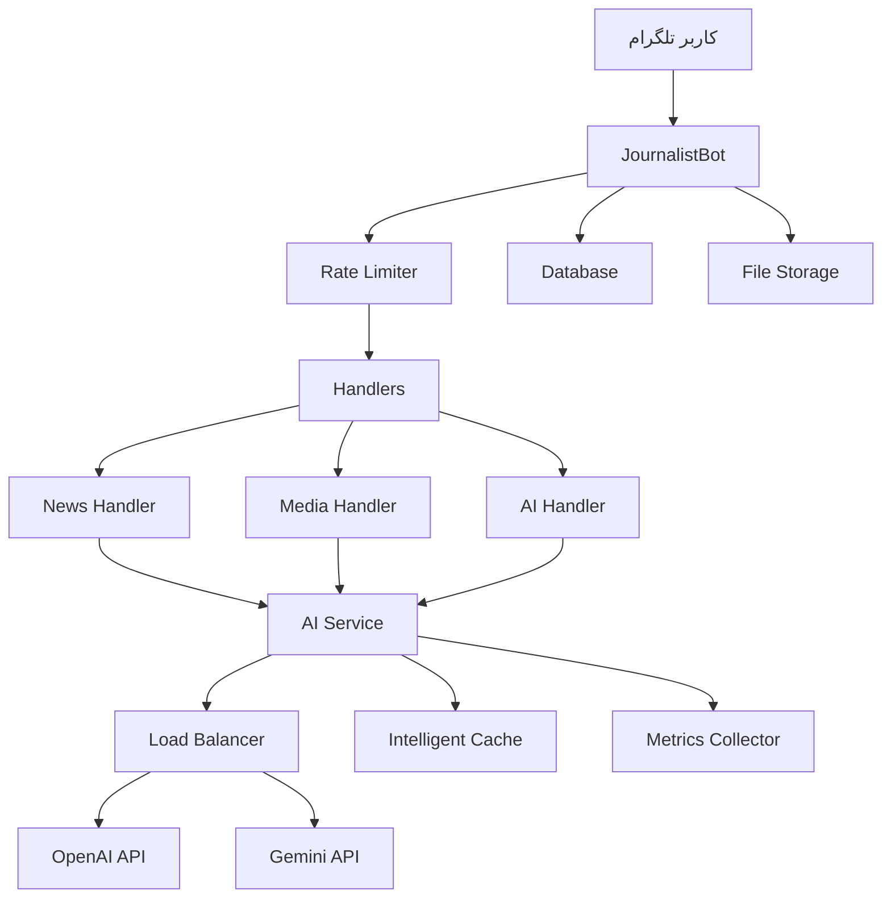

# 🤖 Assistant Journalist Bot

<div align="center">


**ربات هوشمند دستیار خبرنگار با قابلیت‌های پیشرفته AI**

*یک پلتفرم کامل برای تولید محتوا، راستی‌آزمایی، و تولید رسانه با استفاده از هوش مصنوعی*

[دمو زنده](#) • [مستندات](#-مستندات) • [نصب](#-نصب-سریع) • [پشتیبانی](#-پشتیبانی)

</div>

---

## 📋 فهرست مطالب

- [✨ ویژگی‌های کلیدی](#-ویژگی‌های-کلیدی)
- [🏗️ معماری سیستم](#️-معماری-سیستم)
- [🚀 نصب سریع](#-نصب-سریع)
- [⚙️ تنظیمات](#️-تنظیمات)
- [📖 استفاده](#-استفاده)
- [🔧 پیکربندی پیشرفته](#-پیکربندی-پیشرفته)
- [📊 مانیتورینگ](#-مانیتورینگ)
- [🧪 تست](#-تست)
- [🚀 استقرار Production](#-استقرار-production)
- [🤝 مشارکت](#-مشارکت)
- [🆘 پشتیبانی](#-پشتیبانی)

---

## ✨ ویژگی‌های کلیدی

### 📰 تولید محتوای خبری
- **تیتر و لید هوشمند** - سیستم پرامپت حرفه‌ای با محدودیت 7 کلمه
- **خلاصه‌سازی مقالات** - حفظ نکات کلیدی با زبان ساده
- **سوالات مصاحبه** - تولید 10 سوال حرفه‌ای از ساده به پیچیده
- **بیانیه مطبوعاتی** - ساختار استاندارد 5W+H

### 🔍 راستی‌آزمایی پیشرفته
- **پروتکل SWIFT-VERIFY** - سیستم 6 مرحله‌ای تأیید اطلاعات
- **رتبه‌بندی منابع** - طبقه‌بندی 4 سطحی (🟢🟡🟠🔴)
- **گزارش جامع** - شامل درجه اطمینان و راهنمایی عملی
- **تشخیص اخبار جعلی** - الگوریتم‌های پیشرفته تشخیص

### 🎬 تولید رسانه
- **اسکریپت ویدیو بهینه** - معماری شناختی برای حفظ 95% مخاطب
- **قلاب‌های پلتفرم محور** - بهینه‌سازی برای TikTok، Instagram، YouTube
- **اسکریپت پادکست** - ساختار حرفه‌ای با CTA
- **محتوای شبکه‌های اجتماعی** - شامل هشتگ و ایموجی

### 🤖 ابزارهای AI پیشرفته
- **مهندس پرامپت** - روش CRAFT برای تولید پرامپت‌های حرفه‌ای
- **بهینه‌ساز تصویر** - تبدیل ایده به prompt مناسب DALL-E/Midjourney
- **طراح چت‌بات** - ایجاد پرامپت‌های کامل چت‌بات
- **کتابخانه الگو** - مجموعه پرامپت‌های آماده

### ⚡ قابلیت‌های فنی پیشرفته
- **Rate Limiting هوشمند** - مدیریت ترافیک با محدودیت کاربری
- **Caching پیشرفته** - کش هوشمند با TTL و LRU
- **Load Balancing** - تعادل بار بین OpenAI و Gemini
- **Retry Mechanism** - تلاش مجدد با Exponential Backoff
- **Metrics Collection** - جمع‌آوری آمار کامل عملکرد
- **Health Monitoring** - نظارت بر سلامت سیستم

---

## 🏗️ معماری سیستم



### ساختار پروژه

```
assistant_journalist_bot/
├── 🚀 main.py                    # نقطه ورود اصلی
├── 🔐 .env.example              # نمونه تنظیمات
├── 📦 requirements.txt           # وابستگی‌ها
├── 🐳 Dockerfile               # کانتینر Docker
├── 🐳 docker-compose.yml       # Orchestration
├── 📚 README.md                 # مستندات
├── ⚖️ LICENSE                   # مجوز
├── 🚫 .gitignore               # فایل‌های نادیده
│
├── 📂 core/                    # هسته سیستم
│   ├── ⚙️ bot.py               # ربات اصلی + Rate Limiting + Metrics
│   └── 🔧 config.py            # تنظیمات
│
├── 📂 handlers/                # مدیریت کننده‌ها
│   ├── 📰 news_handlers.py     # مدیریت اخبار
│   ├── 🎬 media_handlers.py    # مدیریت رسانه
│   └── 🤖 ai_handlers.py       # مدیریت AI
│
├── 📂 services/               # سرویس‌ها
│   └── 🧠 ai_service.py       # سرویس AI + Cache + Load Balancer
│
├── 📂 utils/                  # ابزارها
│   └── ⌨️ keyboards.py        # کیبوردهای تلگرام
│
├── 📂 data/                   # داده‌ها
│   ├── 📝 prompts.py          # سیستم پرامپت‌های حرفه‌ای
│   └── 📄 templates/          # الگوهای محتوا
│
├── 📂 uploads/                # فایل‌های آپلود شده
├── 📂 cache/                  # کش سیستم
├── 📂 logs/                   # لاگ‌های سیستم
└── 📂 tests/                  # تست‌ها
```

---

## 🚀 نصب سریع

### پیش‌نیازها
- **Python 3.9+** (توصیه: 3.11)
- **FFmpeg** (برای پردازش رسانه)
- **4GB RAM** حداقل (8GB توصیه می‌شود)
- **2GB فضای دیسک** برای کتابخانه‌ها

### 🔧 نصب خودکار (Linux/macOS)

```bash
# دانلود و اجرای اسکریپت نصب
curl -fsSL https://raw.githubusercontent.com/your-repo/install.sh | bash
```

### 📋 نصب دستی

```bash
# 1. کلون پروژه
git clone https://github.com/your-username/assistant-journalist-bot.git
cd assistant-journalist-bot

# 2. ایجاد محیط مجازی
python -m venv venv

# 3. فعال‌سازی محیط مجازی
# Linux/macOS:
source venv/bin/activate
# Windows:
venv\Scripts\activate

# 4. نصب وابستگی‌ها
pip install -r requirements.txt

# 5. کپی تنظیمات
cp .env.example .env

# 6. ویرایش تنظیمات
nano .env  # یا هر ویرایشگر دیگر

# 7. تست سیستم
python main.py --health

# 8. اجرا
python main.py
```

### 🐳 نصب با Docker

```bash
# آماده‌سازی
git clone https://github.com/your-username/assistant-journalist-bot.git
cd assistant-journalist-bot
cp .env.example .env
# ویرایش .env

# اجرای سریع
docker-compose up -d

# مشاهده لاگ‌ها
docker-compose logs -f
```

---

## ⚙️ تنظیمات

### 🔑 API Keys ضروری

#### 1. Telegram Bot Token
```bash
# 1. برو به @BotFather در تلگرام
# 2. ارسال /newbot
# 3. نام و username ربات را انتخاب کن
# 4. Token دریافتی را کپی کن
BOT_TOKEN=1234567890:ABCdefGHIjklMNOpqrsTUVwxyz
BOT_USERNAME=your_bot_username
```

#### 2. OpenAI API Key
```bash
# 1. ثبت نام در https://platform.openai.com
# 2. ایجاد API Key در بخش API Keys
# 3. افزودن اعتبار مالی (حداقل $5)
OPENAI_API_KEY=sk-proj-your_openai_key_here
```

#### 3. Google Gemini API Key
```bash
# 1. رفتن به https://ai.google.dev
# 2. کلیک روی "Get API Key"
# 3. ایجاد پروژه جدید Google Cloud
GEMINI_API_KEY=your_gemini_key_here
```

### 🔧 تنظیمات اختیاری

```env
# News API (برای تأیید اطلاعات)
NEWS_API_KEY=your_news_api_key

# مدیران (کاما جدا شده)
ADMIN_IDS=123456789,987654321

# پایگاه داده
DATABASE_URL=sqlite:///bot.db

# تنظیمات Rate Limiting
MAX_REQUESTS_PER_MINUTE=30
FREE_DAILY_LIMIT=50
PRO_DAILY_LIMIT=500

# تنظیمات Cache
CACHE_TTL_HOURS=12
CACHE_MAX_SIZE=1000
```

---

## 📖 استفاده

### 🎯 دستورات اصلی
- `/start` - شروع ربات و معرفی
- `/menu` - نمایش منوی اصلی
- `/help` - راهنمای کامل استفاده
- `/mystats` - آمار شخصی کاربر
- `/stats` - آمار کلی (فقط ادمین‌ها)

### 📱 نحوه استفاده

#### 1️⃣ تولید تیتر و لید خبری
```
1. کلیک روی "📰 تولید محتوا"
2. انتخاب "📝 نگارش خبر"
3. ارسال متن خبری
4. دریافت 3 جفت تیتر و لید
```

#### 2️⃣ راستی‌آزمایی اطلاعات
```
1. کلیک روی "🔍 تحقیق و تحلیل"
2. انتخاب "✅ راستی‌آزمایی"
3. ارسال ادعا یا اطلاعات
4. دریافت گزارش کامل بررسی
```

#### 3️⃣ تولید اسکریپت ویدیو
```
1. کلیک روی "🎬 تولید رسانه"
2. انتخاب "🎥 اسکریپت ویدیو"
3. ارسال موضوع، مدت و پلتفرم
4. دریافت اسکریپت کامل
```

#### 4️⃣ مهندسی پرامپت
```
1. کلیک روی "⚙️ ابزارهای AI"
2. انتخاب "🤖 مهندس Prompt"
3. توضیح نیازمندی‌های پرامپت
4. دریافت پرامپت حرفه‌ای
```

### 💡 نکات کاربردی

#### ✨ برای بهترین نتایج:
- **متن‌های واضح** ارسال کنید
- **زمینه کافی** ارائه دهید
- **زبان فارسی** استفاده کنید
- **از مثال‌ها** در درخواست استفاده کنید

#### ⚡ محدودیت‌ها:
- **کاربران عادی**: 30 درخواست در دقیقه
- **کاربران پریمیوم**: 100 درخواست در دقیقه
- **حجم فایل**: حداکثر 50MB

---

## 🔧 پیکربندی پیشرفته

### 🏷️ Environment Variables

| متغیر | نوع | پیش‌فرض | توضیح |
|-------|------|---------|-------|
| `BOT_TOKEN` | **ضروری** | - | توکن ربات تلگرام |
| `OPENAI_API_KEY` | ضروری* | - | کلید API OpenAI |
| `GEMINI_API_KEY` | ضروری* | - | کلید API Google Gemini |
| `MAX_REQUESTS_PER_MINUTE` | اختیاری | 30 | محدودیت درخواست در دقیقه |
| `CACHE_TTL_HOURS` | اختیاری | 12 | مدت زمان نگهداری کش |
| `LOG_LEVEL` | اختیاری | INFO | سطح لاگ (DEBUG/INFO/WARNING/ERROR) |

*\* حداقل یکی از OpenAI یا Gemini ضروری است*

### 🔄 Load Balancing

سیستم به صورت خودکار بین OpenAI و Gemini تعادل برقرار می‌کند:

```python
# تنظیمات Load Balancer
LOAD_BALANCER_STRATEGY = "performance"  # performance/round_robin/random
```

### 💾 Cache Configuration

```python
# تنظیمات Cache
CACHE_BACKEND = "memory"  # memory/redis/database
CACHE_MAX_SIZE = 1000     # تعداد ورودی‌ها
CACHE_TTL_HOURS = 12      # مدت زمان نگهداری
```

### 📊 Metrics Configuration

```python
# تنظیمات Metrics
METRICS_ENABLED = True
METRICS_RETENTION_DAYS = 30
METRICS_EXPORT_FORMAT = "json"  # json/csv/prometheus
```

---

## 📊 مانیتورینگ

### 📈 آمار در دسترس

#### آمار کلی ربات
```bash
# دسترسی از طریق دستور
/stats

# شامل:
- زمان فعالیت
- تعداد کاربران
- کاربران فعال امروز
- کل پیام‌ها
- درخواست‌های AI
- نرخ خطا
- میانگین زمان پاسخ
```

#### آمار شخصی کاربر
```bash
# دسترسی از طریق دستور  
/mystats

# شامل:
- مدت عضویت
- تعداد پیام‌ها
- درخواست‌های AI
- وضعیت Rate Limiting
```

### 📋 Dashboard وب (در حال توسعه)

```bash
# اجرای dashboard
python dashboard.py

# دسترسی در:
http://localhost:8080/dashboard
```

### 📊 Export آمار

```bash
# Export به JSON
python main.py --export-stats json

# Export به CSV
python main.py --export-stats csv

# Export به Prometheus
python main.py --export-stats prometheus
```

---

## 🧪 تست

### 🔍 تست سلامت سیستم

```bash
# بررسی کلی
python main.py --health

# بررسی AI Services
python -m services.ai_service --health

# بررسی اتصال به APIs
python -c "from services.ai_service import ai_service; import asyncio; asyncio.run(ai_service.health_check())"
```

### 🧪 تست‌های Unit

```bash
# نصب ابزارهای تست
pip install pytest pytest-asyncio pytest-cov

# اجرای تست‌ها
pytest tests/ -v

# تست با coverage
pytest tests/ --cov=. --cov-report=html
```

### 🎯 تست‌های Integration

```bash
# تست کامل با ربات واقعی
pytest tests/integration/ -v --bot-token=YOUR_TEST_TOKEN

# تست Load
python tests/load_test.py --users=100 --duration=300
```

### 📝 تست‌های دستی

```bash
# ارسال پیام تست
curl -X POST "https://api.telegram.org/bot<TOKEN>/sendMessage" \
  -H "Content-Type: application/json" \
  -d '{"chat_id":"YOUR_CHAT_ID","text":"/start"}'
```

---

## 🚀 استقرار Production

### 🐳 استقرار با Docker

#### Docker Compose (توصیه شده)

```yaml
# docker-compose.prod.yml
version: '3.8'

services:
  journalist-bot:
    build: .
    container_name: assistant-journalist-bot
    restart: unless-stopped
    env_file:
      - .env.production
    volumes:
      - ./logs:/app/logs
      - ./uploads:/app/uploads
      - ./cache:/app/cache
    environment:
      - TZ=Asia/Tehran
      - ENVIRONMENT=production
    healthcheck:
      test: ["CMD", "python", "main.py", "--health"]
      interval: 30s
      timeout: 10s
      retries: 3
    logging:
      driver: "json-file"
      options:
        max-size: "10m"
        max-file: "3"

  redis:
    image: redis:7-alpine
    container_name: bot-redis
    restart: unless-stopped
    volumes:
      - redis_data:/data
    command: redis-server --appendonly yes

  nginx:
    image: nginx:alpine
    container_name: bot-nginx
    ports:
      - "80:80"
      - "443:443"
    volumes:
      - ./nginx.conf:/etc/nginx/nginx.conf
      - ./ssl:/etc/nginx/ssl
    depends_on:
      - journalist-bot

volumes:
  redis_data:
```

#### اجرای Production

```bash
# آماده‌سازی
cp .env.example .env.production
# ویرایش تنظیمات production

# اجرا
docker-compose -f docker-compose.prod.yml up -d

# مانیتورینگ
docker-compose -f docker-compose.prod.yml logs -f
```

### ☁️ استقرار در Cloud

#### AWS EC2
```bash
# 1. ایجاد instance
aws ec2 run-instances \
  --image-id ami-0abcdef1234567890 \
  --count 1 \
  --instance-type t3.medium \
  --key-name my-key-pair

# 2. نصب Docker
sudo yum update -y
sudo yum install -y docker
sudo service docker start

# 3. استقرار
git clone https://github.com/your-repo/assistant-journalist-bot.git
cd assistant-journalist-bot
sudo docker-compose -f docker-compose.prod.yml up -d
```

#### Google Cloud Run
```bash
# 1. ساخت image
gcloud builds submit --tag gcr.io/PROJECT-ID/journalist-bot

# 2. استقرار
gcloud run deploy --image gcr.io/PROJECT-ID/journalist-bot \
  --platform managed \
  --memory 2Gi \
  --cpu 1 \
  --max-instances 10
```

#### DigitalOcean Droplet
```bash
# 1. ایجاد Droplet
doctl compute droplet create assistant-bot \
  --size s-2vcpu-4gb \
  --image ubuntu-20-04-x64 \
  --region nyc1

# 2. نصب و راه‌اندازی
ssh root@droplet-ip
curl -fsSL https://get.docker.com | sh
git clone https://github.com/your-repo/assistant-journalist-bot.git
cd assistant-journalist-bot
docker-compose -f docker-compose.prod.yml up -d
```

### 🔒 امنیت Production

#### SSL/TLS
```bash
# نصب Certbot
sudo apt install certbot python3-certbot-nginx

# دریافت گواهی SSL
sudo certbot --nginx -d yourdomain.com

# تجدید خودکار
sudo crontab -e
# اضافه کردن:
0 12 * * * /usr/bin/certbot renew --quiet
```

#### Firewall
```bash
# UFW (Ubuntu)
sudo ufw allow ssh
sudo ufw allow 80
sudo ufw allow 443
sudo ufw enable

# iptables
iptables -A INPUT -p tcp --dport 22 -j ACCEPT
iptables -A INPUT -p tcp --dport 80 -j ACCEPT
iptables -A INPUT -p tcp --dport 443 -j ACCEPT
```

#### Environment Security
```bash
# تنظیمات امن .env.production
chmod 600 .env.production
chown root:root .env.production

# استفاده از secrets
docker secret create bot_token /path/to/bot_token.txt
```

### 📊 مانیتورینگ Production

#### Prometheus + Grafana
```yaml
# docker-compose.monitoring.yml
version: '3.8'

services:
  prometheus:
    image: prom/prometheus
    ports:
      - "9090:9090"
    volumes:
      - ./prometheus.yml:/etc/prometheus/prometheus.yml

  grafana:
    image: grafana/grafana
    ports:
      - "3000:3000"
    environment:
      - GF_SECURITY_ADMIN_PASSWORD=admin
```

#### Log Aggregation
```bash
# ELK Stack
docker run -d --name elasticsearch \
  -p 9200:9200 -p 9300:9300 \
  -e "discovery.type=single-node" \
  elasticsearch:7.14.0

docker run -d --name kibana \
  -p 5601:5601 \
  --link elasticsearch:elasticsearch \
  kibana:7.14.0
```

---

## 🔧 عیب‌یابی

### ❌ مشکلات رایج

#### 1. خطای "ModuleNotFoundError"
```bash
# حل:
source venv/bin/activate  # فعال‌سازی مجدد محیط مجازی
pip install -r requirements.txt  # نصب مجدد وابستگی‌ها
```

#### 2. خطای "FFmpeg not found"
```bash
# Ubuntu/Debian:
sudo apt update && sudo apt install ffmpeg

# CentOS/RHEL:
sudo yum install epel-release && sudo yum install ffmpeg

# macOS:
brew install ffmpeg

# Windows:
choco install ffmpeg
```

#### 3. خطای "API Rate Limit"
```bash
# بررسی تنظیمات Rate Limiting
grep -i "rate" .env

# کاهش تعداد درخواست‌ها
echo "MAX_REQUESTS_PER_MINUTE=10" >> .env
```

#### 4. خطای "Memory Error"
```bash
# افزایش حافظه Docker
docker-compose -f docker-compose.yml up -d --memory 2g

# یا تنظیم در docker-compose.yml:
services:
  journalist-bot:
    deploy:
      resources:
        limits:
          memory: 2G
```

### 🔍 ابزارهای Debug

#### لاگ‌های تفصیلی
```bash
# فعال‌سازی debug mode
export LOG_LEVEL=DEBUG
python main.py

# مشاهده لاگ‌های real-time
tail -f logs/bot.log | grep ERROR
```

#### پروفایلینگ عملکرد
```python
# اضافه کردن به main.py
import cProfile
import pstats

def profile_bot():
    pr = cProfile.Profile()
    pr.enable()
    # کد ربات
    pr.disable()
    stats = pstats.Stats(pr)
    stats.dump_stats('bot_profile.prof')
```

#### Memory Profiling
```bash
# نصب memory profiler
pip install memory-profiler

# اجرا با profiler
python -m memory_profiler main.py
```

### 📞 دریافت کمک

#### 1. بررسی مستندات
- [راهنمای نصب کامل](install_guide.md)
- [مستندات API](docs/api.md)
- [FAQ](docs/faq.md)

#### 2. لاگ‌های سیستم
```bash
# جمع‌آوری اطلاعات debug
python main.py --debug-info > debug_report.txt
```

#### 3. گزارش مشکل
قبل از گزارش مشکل، لطفاً این اطلاعات را آماده کنید:
- نسخه Python: `python --version`
- نسخه ربات: `python main.py --version`
- سیستم عامل و نسخه
- متن کامل خطا
- فایل لاگ (logs/bot.log)

---

## 🤝 مشارکت

ما از مشارکت شما استقبال می‌کنیم! 🎉

### 🌟 نحوه مشارکت

#### 1. Fork و Clone
```bash
# Fork repository در GitHub
git clone https://github.com/YOUR_USERNAME/assistant-journalist-bot.git
cd assistant-journalist-bot
```

#### 2. Development Environment
```bash
# ایجاد branch جدید
git checkout -b feature/amazing-feature

# نصب dev dependencies
pip install -r requirements-dev.txt

# نصب pre-commit hooks
pre-commit install
```

#### 3. Coding Standards
```bash
# فرمت کردن کد
black .
isort .

# بررسی کیفیت کد
flake8 .
pylint src/

# تست‌ها
pytest tests/ -v
```

#### 4. ارسال تغییرات
```bash
# Commit با پیام معنادار
git add .
git commit -m "feat: add amazing new feature"

# Push کردن
git push origin feature/amazing-feature

# ایجاد Pull Request در GitHub
```

### 📋 راهنمای مشارکت

#### 🎯 نوع مشارکت‌ها
- **🐛 Bug Fixes** - رفع اشکالات
- **✨ New Features** - ویژگی‌های جدید  
- **📚 Documentation** - بهبود مستندات
- **🎨 UI/UX** - بهبود رابط کاربری
- **⚡ Performance** - بهینه‌سازی عملکرد
- **🔒 Security** - بهبود امنیت

#### 📝 استانداردهای کد
- **Python Style**: PEP 8
- **Docstrings**: Google Style
- **Type Hints**: فعال برای توابع عمومی
- **Comments**: به زبان فارسی یا انگلیسی
- **Tests**: برای تمام ویژگی‌های جدید

#### 🏷️ Commit Messages
```bash
# فرمت:
type(scope): description

# مثال‌ها:
feat(ai): add sentiment analysis
fix(bot): resolve memory leak issue
docs(readme): update installation guide
style(core): format code with black
refactor(handlers): improve error handling
test(ai): add unit tests for cache
```

### 🏆 تشویق مشارکت‌کنندگان

#### 🎖️ Hall of Fame
بهترین مشارکت‌کنندگان ماه:
- [@contributor1](https://github.com/contributor1) - 15 commits
- [@contributor2](https://github.com/contributor2) - 8 bug fixes
- [@contributor3](https://github.com/contributor3) - Documentation

#### 🎁 پاداش‌ها
- **First Contribution**: Badge ویژه
- **Bug Hunter**: یافتن 5+ باگ
- **Feature Creator**: اضافه کردن 3+ ویژگی
- **Documentation Master**: بهبود مستندات

---

## 📄 مجوز

این پروژه تحت [مجوز MIT](LICENSE) منتشر شده است.

```
MIT License

Copyright (c) 2025 Assistant Journalist Bot Team

Permission is hereby granted, free of charge, to any person obtaining a copy
of this software and associated documentation files (the "Software"), to deal
in the Software without restriction, including without limitation the rights
to use, copy, modify, merge, publish, distribute, sublicense, and/or sell
copies of the Software, and to permit persons to whom the Software is
furnished to do so, subject to the following conditions:

The above copyright notice and this permission notice shall be included in all
copies or substantial portions of the Software.

THE SOFTWARE IS PROVIDED "AS IS", WITHOUT WARRANTY OF ANY KIND, EXPRESS OR
IMPLIED, INCLUDING BUT NOT LIMITED TO THE WARRANTIES OF MERCHANTABILITY,
FITNESS FOR A PARTICULAR PURPOSE AND NONINFRINGEMENT.
```

---

## 🆘 پشتیبانی

### 📞 راه‌های تماس

#### 🐛 گزارش باگ
[](https://github.com/your-username/assistant-journalist-bot/issues)

برای گزارش باگ، لطفاً از [GitHub Issues](https://github.com/your-username/assistant-journalist-bot/issues/new?template=bug_report.md) استفاده کنید.

#### 💡 درخواست ویژگی
[](https://github.com/your-username/assistant-journalist-bot/issues/new?template=feature_request.md)

برای درخواست ویژگی جدید، از [اینجا](https://github.com/your-username/assistant-journalist-bot/issues/new?template=feature_request.md) استفاده کنید.

#### 💬 پشتیبانی عمومی
- **تلگرام**: [@assistant_journalist_support](https://t.me/assistant_journalist_support)
- **ایمیل**: support@assistant-journalist-bot.com
- **Discord**: [سرور Discord ما](https://discord.gg/your-invite)

#### 📚 منابع آموزشی
- **مستندات کامل**: [docs.assistant-journalist-bot.com](https://docs.assistant-journalist-bot.com)
- **ویدیوهای آموزشی**: [کانال یوتیوب](https://youtube.com/channel/your-channel)
- **مقالات**: [وبلاگ](https://blog.assistant-journalist-bot.com)

### ⏰ زمان پاسخ‌گویی
- **باگ‌های Critical**: کمتر از 24 ساعت
- **سوالات عمومی**: 2-3 روز کاری
- **درخواست ویژگی**: 1 هفته برای بررسی

### 🌐 کامیونیتی
[](https://t.me/assistant_journalist_community)
[](https://discord.gg/your-invite)
[](https://reddit.com/r/AssistantJournalistBot)

---

## 🎉 تشکر ویژه

### 💝 حامیان مالی
- **OpenAI** - ارائه API credits
- **Google Cloud** - سرویس‌های ابری رایگان
- **JetBrains** - لایسنس PyCharm

### 🤝 مشارکت‌کنندگان
```
Contributors:
┌─────────────────────────────────────────────┐
│  👨‍💻 Lead Developer     │  🎨 UI/UX Designer     │
│  📚 Documentation Lead │  🔒 Security Expert    │
│  🧪 QA Engineer        │  🌐 DevOps Engineer    │
└─────────────────────────────────────────────┘
```

### 🙏 تشکر از
- **جامعه Python** - ابزارها و کتابخانه‌های فوق‌العاده
- **تیم Telegram** - API و پلتفرم عالی
- **کاربران Beta** - فیدبک‌های ارزشمند

---

<div align="center">

## 🌟 ستاره‌دهی

اگر این پروژه برایتان مفید بود، لطفاً ⭐ ستاره دهید!

[](https://github.com/your-username/assistant-journalist-bot/stargazers)
[](https://github.com/your-username/assistant-journalist-bot/network/members)
[](https://github.com/your-username/assistant-journalist-bot/watchers)

---

**🚀 آماده تبدیل شدن به قدرتمندترین دستیار خبرنگاری!**

*با ❤️ ساخته شده برای جامعه خبرنگاری ایران*

</div>
